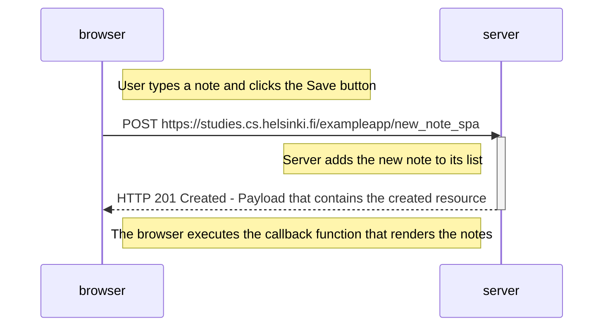

```mermaid
sequenceDiagram
    participant browser
    participant server

    Note right of browser: User types a note and clicks the Save button

    browser->>server: POST https://studies.cs.helsinki.fi/exampleapp/new_note_spa
    activate server
    Note left of server: Server adds the new note to its list
    server-->>browser: HTTP 201 Created - Payload that contains the created resource
    deactivate server

    Note right of browser: The browser executes the callback function that renders the notes
```
   